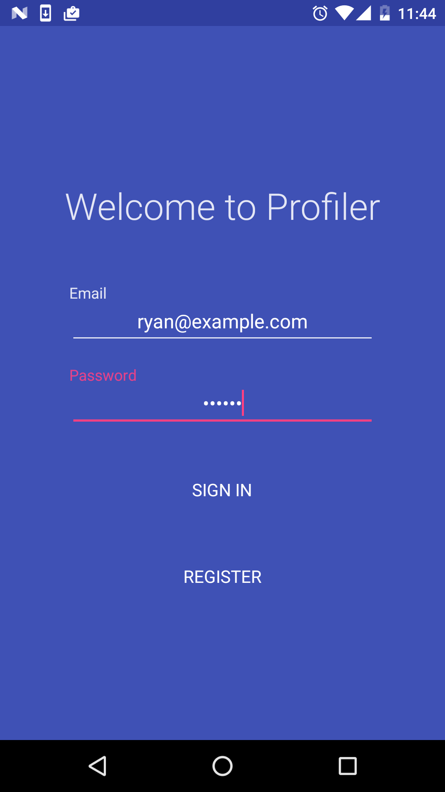
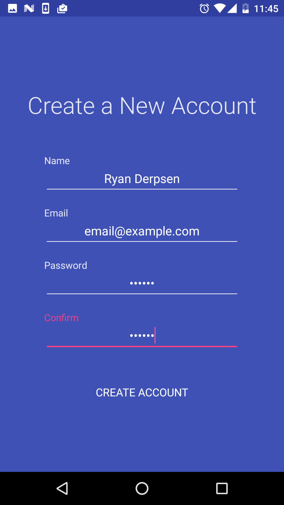
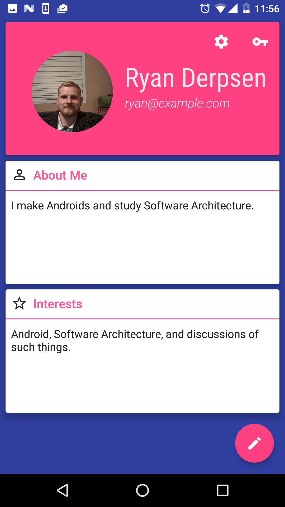
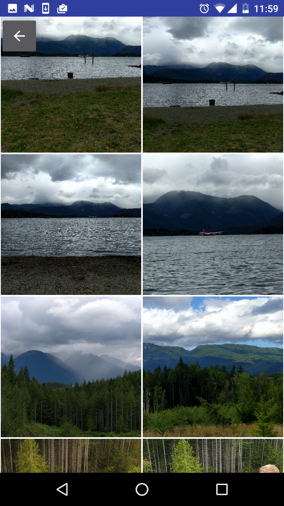

# Profiler

## Topics
* [What is Profiler?](#what-is-profiler)
* [Can I use the code?](#can-i-use-code-from-this-repo)
* [I'm a Beginner](#im-a-beginner)
* [I'm Intermediate Dev, curious about the APIs/Project](#im-a-juniorintermediate-developer)
* [I'm a Senior Dev, curious about the APIs/Project](#im-an-intermediatesenior-developer)
* [Project APIs/Concepts](#apis-and-architectures-used)
* [Learning Sources/Inspiration](#sources)
* [Support Me](#contactsupport-me)
* [Changes](#Changes)
* [License](#license)

## What is Profiler?

Profiler is an open source App project which intends to demonstrate a functional and adequetely tested "Social Media" Android App.
I'll be building multiple iterations of the App, starting with basic features such as User Authentication and Data storage, moving towards features such as live Chat
(it wouldn't be much of a Social Media app otherwise). I also take immense effort to use the best tools for the job for APIs and Software Architecture Patterns, insofar as my knowledge/experience with them will allow.

The purpose of this project is to be both a tool to focus my own learning of Android Mobile Developement, and a teaching aid for when I feel comfortable explaining what I'm doing. Although I'm certainly not an Expert Developer, I've been told that my rambling has helped people in the past. I also frequently Livestream work on this project (among others), so that I'm able to both give and get feedback about Android Developement problems.

### Login Component

### Create Account Component

### Profile Page Component

### Gallery Component Component

## Can I use code from this Repo?
Absolutely, pursuant to the project's [LICENSE](LICENSE.md). I primarily learned how to build Profiler by learning from free sources and referencing open source libraries, many of which I list (here)[#sources]. That being said, the logo (whenever I get around to making it) and name are my intellectual creations, so don't use them unless you are linking/reffering to this Repo.

Follow the rules in the license, and you're good.

## Learning Use Cases
### I'm a Beginner
If you're brand new to Android (or Programming in general), this probably isn't the droid you're looking for. While learning about Software Architecture is **SUPER IMPORTANT**, worrying about RxJava before learning the basics is like worrying about how to cook a Risotto before learning how to turn the stove on. As Gordon Ramsay would say, get the **** out of my kitchen!

Ok joking aside, here's what I would suggest, whether you learn this stuff from [my tutorials](http://wiseassblog.com/tutorials/) or not:
1. Make a Hello World App, and get it deployed to a Device/Emulator.
2. Make an App which doesn't need to store data, but does need to manipulate input from a user; I'd strongly suggest a [Calculator](https://github.com/BracketCove/Calculator).

For a softer introduction to Android, please see my [Beginner Android Dev Series](https://www.youtube.com/playlist?list=PLEVlop6sMHCp3Wp0mqT2-OxHwVdAod1uy)

### I'm a Junior/Intermediate Developer
I'm going to be creating content over the next few months explaining the APIs and Concepts that the App uses. I intend to have articles explaining how the following APIs/Concepts fit into the App:
* FirebaseAuth and FirebaseRealtimeDatabase.
* RxJava 2
* Model-View-Presenter
* Unit Testing with Mockito

This is an incomplete list which will be added to over time.

### I'm an Intermediate/Senior Developer
My goal with this App is to write good code, and use the best tools for the job (as far as I'm currently aware of "the best tools"). Please view my implementations of such tools as the work of a fellow student of Software Development, not an expert. If you see some room for improvement in any of the following areas, please bring it up with me!
* Optimal Implementation of 3rd Party Libraries (Rx, Firebase, Dagger 2)
* Gradle best practices (That's my next big learning project)
* Anything to do with Software Architecture and Design Patterns (I enjoy nerding out about any of these topics)

## APIs and Architectures Used:
* Firebase (FirebaseAuth and Realtime Database) for User/Data management
* RxJava/RxAndroid 2 for concurrency (mostly to communicate between Presenter and Service Layers)
* Mockito to help with Unit Testing
* Picasso for Image Loading
* Model View Presenter Architecture

I'm also looking at adding the following Libraries for future iterations:
* Dagger 2
* Firebase Cloud Messaging
* LeakCanary
* Realm for local Storage (Yes, I know that FRTD kind of does this)

## Sources

It's no exaggeration to say that this project wouldn't have been possible for me to make, were it not for the following talks and open source codebases. I have to give my biggest thanks to everyone involved in the [Android Architecture Blueprints](https://github.com/googlesamples/android-architecture) project. Much of Profiler's code is based off of code from this project, and I would've failed epicly to get it off the ground without such an awesome resource. When I'm more confident in my skills, I would love to help <3<3<3.

If becoming a better developer is your goal, please visit, read, listen, and play around with the following sources:
* [Futurice's Android Best Practices Repo](https://github.com/futurice/android-best-practices). Awesome overview of Android Development Best Practices.
* [Jake Wharton on RxJava 2](https://www.youtube.com/watch?v=htIXKI5gOQU&t=1795s). Jake does an awesome job explaining how RxJava works conceptually, and overviews the new RxJava 2 API changes. Must watch for RxJava noobs.
* [Model View Presenter by Michael Cameron](https://www.youtube.com/watch?v=AoqL1PN8hCk&t=1229s). Very solid explanation of MVP for Android, and some extra tips for testing and so forth.
* [Testing made Sweet with a Mockito by Jeroen Mols](https://www.youtube.com/watch?v=DJDBl0vURD4&t=33s). One of my biggest frustrations with this project was how poorly people seem to Explain Unit Testing (that's partly because Android finally has some decent options for it). Not only does Jeroen explain the Mockito Testing API, but he gives plenty of insight as to what you actually want to test! This was the talk that made Unit Testing finally start to make sense for me.
* [Fragmented Podcast](http://fragmentedpodcast.com/). Donn and Kaushik are doing everyone a huge service with this podcast. If you're a noob like me, listening to these two along with their all star guest line up (as far as Android goes) should be mandatory! I truly can't think of a better place to expose myself to powerful ideas and concepts from the Demi-gods of Dev.

## Contact/Support me:
It's my personal goal to create free high-quality content, accesible by anyone who has an Internet connection, as I don't feel ownership over knowledge which has graciously been given to me for free (I've never taken a paid course for Android Development).

That being said, if the 200+ hours of my time spent coding, researching, making learning aids, and producing content for this project, and the effort I take to explain things in a simple and clear way (which I often fail to do), is worth throwing a bit of money at, then please do!

If you're in a position where monetary support isn't an option, then you can also help out by liking/sharing my stuff on Social Media. This helps me with SEO and building an audience, and I greatly appreciate it! Lastly, drop me a comment on one of my videos.

## Changes:

As of writing this commit, here is a non-exhaustive list of changes I plan to implement, when I have time to develope this App further (I'm working on multiple projects and I must use my spare time very deliberately):

**Refactor Unit Tests:** Now that I'm more comfortable working with RxJava, Mockito, and Dagger in Unit Tests, I'll refactor Profiler's tests to be more useful, and easier/quicker to write. See my Repo [PosTrainer](https://github.com/BracketCove/PosTrainer) for my current approach to Unit Tests.

**Change Authentication:** I'm going to change Authentication to use Firebase REST Auth. I'd like to incorporate REST using Retrofit and OKHttp into another App. 

**Get Rid of Photo Gallery and Detail Features:** It doesn't make sense to not use a third party solution for this, whether that means a Library or just receiving some Data from another App via OnActivityResult. 

[G+](https://plus.google.com/+wiseass)

[Facebook](https://www.facebook.com/wiseassblog/)

[Twitter](https://twitter.com/wiseAss301)

[Patreon](https://www.patreon.com/bePatron?u=5114325)

[Primary Website](http://wiseassblog.com/)

## License
 * Copyright 2016, The Android Open Source Project
 *
 * Licensed under the Apache License, Version 2.0 (the "License");
 * you may not use this file except in compliance with the License.
 * You may obtain a copy of the License at
 *
 *      http://www.apache.org/licenses/LICENSE-2.0
 *
 * Unless required by applicable law or agreed to in writing, software
 * distributed under the License is distributed on an "AS IS" BASIS,
 * WITHOUT WARRANTIES OR CONDITIONS OF ANY KIND, either express or implied.
 * See the License for the specific language governing permissions and
 * limitations under the License.
 *
